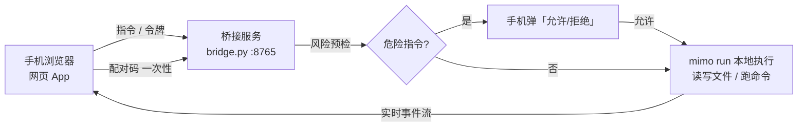

# MiMo POCKET（MiMo Phone Bridge）

> **用手机远程指挥你的电脑**：手机上打开一个网页 → 说话 → 电脑本地的 MiMo 真实执行（可读写文件、跑命令）→ 结果实时回传手机。电脑不在身边时，也能监督并推进电脑上的任务。

非官方个人项目。**手机端零安装**——它是一个由你电脑托管的网页（PWA 体验），扫码即用。



## 功能

| 能力 | 说明 |
|------|------|
| 💬 对话执行 | 手机发指令，电脑本地执行并回复 |
| 👀 过程可见 | 工具调用 / 文件操作 / 回复 实时流式显示 |
| 🔒 权限闸门 | `rm`、删库、`git push`、提权等危险指令先停住，手机点「允许」才执行 |
| ✅ 任务卡片 | 全部任务一览，进行中可**一键取消**（真的 kill 掉执行进程） |
| 📁 文件面板 | 浏览 / 预览电脑工作目录（仅限该目录内） |
| 🔀 任意会话 | 进入电脑上任意历史会话继续对话 |
| 🔁 换模型 | 页面点选，下一条立即生效 |
| 📱 扫码配对 | 一次性 6 位配对码；每次启动换发随机令牌，**手机上不存在固定口令** |
| 🛡 自愈 | 开机自启 + 看门狗 8 秒探测，服务被杀约 10 秒自动恢复 |

## 前置条件

1. **Windows** 电脑（其他系统需自行调整 `install.ps1` / `watchdog.py` 的启动方式）
2. **Python 3.10+**、**Node 18+**
3. **MiMoCode CLI** 并已登录可用模型 —— 这是执行引擎，没有它桥接无法干活：
   ```powershell
   npm i -g @mimo-ai/cli
   mimo          # 首次运行按提示登录 / 配置模型
   ```
4. 手机与电脑在**同一 Wi-Fi**（出门远程见下文 Tailscale）

## 快速开始

```powershell
git clone <本仓库地址>
cd mimodesktop
powershell -ExecutionPolicy Bypass -File .\install.ps1
```

安装脚本会：检查依赖 → 装二维码库 → 注册 MiMo 技能（`/手机配对二维码`）→ 注册开机自启 → 启动服务。

然后只做一件事——**配对**：

| 方式 | 操作 |
|------|------|
| 🗣 对 MiMo 说 | 在 MiMo Desktop 里说「**给我配对码**」或「**二维码**」，码和二维码会贴在对话里 |
| 🌐 电脑浏览器 | 打开 `http://127.0.0.1:8765/pair`（大图二维码） |
| 💻 终端 | `python bridge\bridge.py qr` |

手机相机扫二维码 → 自动打开页面并配对 → **建议立刻「添加到主屏幕」**（iOS 分享 / Android 菜单），之后就像用 App 一样。

> 配对码 **10 分钟有效、一码一用**。之后每次打开页面都自动换发当次令牌，无需再登录。只有换手机、清浏览器数据、作废设备时才需要重新配对。

## 手机端怎么用

| Tab | 用途 |
|-----|------|
| **会话** | 说话执行；输入框上方是实时过程条（工具 / 文件 / 回复） |
| **文件** | 浏览、预览电脑工作目录（`..` 返回上级，点文件看内容） |
| **任务** | 所有任务卡片与状态；执行中 / 待确认的可**取消** |
| **模型** | 点选切换模型，下一条消息立即生效 |
| **历史** | 进入电脑上任意会话：读记录，也能继续对话 |

危险指令出现橙色确认卡时，看清风险描述再点「允许执行」或「拒绝」。

## 工作原理（电脑端发生什么）

1. `bridge.py` 常驻后台收指令（看门狗保活、开机自启）
2. **风险预检**：命中危险模式 → 停在 `awaiting_approval` 等手机确认
3. **本地执行**：`mimo run --model <当前模型> --session <手机专属会话> "你的指令"`，真实读写本地文件、执行命令
4. **过程直播**：执行中的 `tool` / `text` 事件实时推回手机
5. **结果写回**：回复出现在对话里，任务卡片变「完成」

电脑上开着的 MiMo Desktop 聊天窗口**不参与**这件事——手机用自己的独立会话，互不打断。想看 / 续电脑那段对话，用「历史」页切过去。

## 配对与安全模型

```
配对（一次性）  6 位码 → 下发 device_id + device_secret   ← 只存手机本地，不当 API 口令用
每次启动        POST /api/session → 全新随机令牌（只存内存）← 旧令牌立即作废
电脑侧主令牌    auth_token.txt                          ← 仅 CLI / 看板兜底
```

- 二维码里只有**短命配对码**，不含设备凭据与长期令牌，被拍走也没用
- 除本机回环外**所有接口都要令牌**；配对码/登录失败按**真实客户端 IP** 限流（180 秒内 10 次锁定，正确令牌不受影响；隧道流量按 `CF-Connecting-IP` 识别，且**只信任来自本机的转发头**，无法伪造绕过）
- **配对码一码一用**、10 分钟过期；设备凭据只存 SHA-256 哈希；会话令牌**只存哈希**（`sessions.json` 被读走也无法直接使用）
- 文件接口限制在工作目录内，越界返回 400
- ⚠️ **局域网模式是明文 HTTP**：共享 Wi-Fi 下令牌理论上可被嗅探。共享网络请优先用 `tunnel on`（HTTPS），或改用 Tailscale
- ⚠️ 共享 Wi-Fi 下也安全，但**不要**把 8765 端口直接做端口映射暴露公网

### 发布前安全审计（2026-09）

| 类别 | 结论 |
|------|------|
| 本机信息泄露 | ✅ 已清：无用户名/绝对路径/内网 IP/会话 ID/令牌；示例数据已泛化 |
| 鉴权 | ✅ fail-closed（隧道回源走 127.0.0.1 也强制令牌）；令牌比较用 `hmac.compare_digest` |
| 暴力破解 | ✅ 配对码/令牌/设备凭据三条路都限流（10 次 / 180 秒 / 真实 IP） |
| 凭据存储 | ✅ 设备密钥与会话令牌均只存哈希；主令牌 40 位随机、仅本机可读 |
| 命令注入 | ✅ 所有外部命令走参数数组（无 `shell=True`）；路径 API 用 `resolve()` 防目录穿越 |
| 已知取舍 | CORS 为 `*`（配合 Bearer 令牌，无 Cookie）；局域网明文 HTTP（见上方警告） |

## 出门也能用

### 方式 A · cloudflared 公网隧道（内置，最快）

```powershell
python bridge\bridge.py tunnel on     # 开启公网隧道（首次自动使用 cloudflared）
python bridge\bridge.py qr            # 二维码已自动变为公网地址
```

手机**用流量**扫码 → 自动配对 → 即可操作。用完 `python bridge\bridge.py tunnel off` 关闭。

- 公网地址每次开启都会变（Cloudflare 快速隧道），二维码/链接自动跟随
- **安全**：公网请求一律强制令牌（fail-closed——隧道回源走 127.0.0.1 也绕不过鉴权），配对码 10 分钟一次性、用完即废
- ⚠️ 若报「隧道建立失败」，多半是本机代理/VPN（Clash 的 TUN 模式）掐断了 cloudflared：先关 TUN 模式再试；或给代理加直连规则放行 `argotunnel.com` / `trycloudflare.com`
- 建议：出门前开启、回家后关闭；需要固定地址见方式 B 的命名隧道

### 方式 B · Tailscale（推荐长期用，地址固定）

桥接会**自动检测 Tailscale**：装好并登录后，配对二维码 / 链接会自动改用 `100.x.x.x` 地址——它在家里和外面都通，无需改配置。

1. 电脑装 [Tailscale](https://tailscale.com/download) 并登录
2. 手机装 Tailscale，同账号登录
3. 手机重新扫一次配对码（或直接打开 `http://<电脑的 100.x.x.x>:8765`）——链接已是 Tailscale 地址

`/api/status` 的 `tailscale` 字段显示当前检测到的地址（空 = 未安装或未登录）。点对点加密、**不暴露公网**。次选 Cloudflare Tunnel / frp（会暴露公网 URL，务必配合上面的令牌鉴权）。

## 命令参考

```powershell
python bridge\bridge.py start      # 启动服务（前台）
python bridge\bridge.py stop       # 停止
python bridge\bridge.py status     # 状态 / 地址 / 当前模型
python bridge\bridge.py pair       # 打印 6 位配对码
python bridge\bridge.py qr         # 生成配对二维码 PNG
python bridge\bridge.py token      # 打印主令牌（保密）
python bridge\bridge.py sessions   # 列出 MiMo 会话
python bridge\bridge.py history --session <id> --limit 40
python bridge\watchdog.py          # 启动看门狗（自愈，推荐常驻）
```

环境变量：`PHONE_REMOTE_PORT`（默认 8765）、`PHONE_REMOTE_WORKDIR`（默认仓库根目录）、`PHONE_REMOTE_MODEL`（默认模型兜底）、`PHONE_REMOTE_TOKEN`（覆盖主令牌）、`PHONE_REMOTE_HOME`（数据目录）。

## 目录结构

```
mimodesktop/
├── index.html          # 手机端网页 App（单文件，零构建）
├── install.ps1         # 一键安装
├── bridge/
│   ├── bridge.py       # 桥接服务（HTTP API + 执行 + 鉴权 + 风险闸门）
│   ├── watchdog.py     # 看门狗：探测失联并自动拉起
│   ├── qr.js           # 二维码生成（qrcode）
│   └── package.json
└── skills/             # 可选：MiMo 技能（/手机配对二维码、/手机远程指令）
    ├── phone-qr/
    └── phone-remote/
```

运行时数据（令牌、设备、任务、日志）在 `~/.local/share/mimocode/phone-remote/`，**不会**被 git 提交。

## 排障

| 现象 | 原因 | 处理 |
|------|------|------|
| 手机打不开页面 | 不在同一 Wi-Fi / 防火墙拦 8765 | `bridge.py status` 确认 running；允许 Python 专用网络；确认用了 status 打印的 LAN URL |
| 页面显示「演示模式」 | 服务地址不对或没鉴权 | 点右上角状态灯改服务地址；重新配对 |
| 登录页说「令牌无效」 | 输的不是 6 位配对码 / 码过期 | 重新取码（对 MiMo 说「给我配对码」） |
| 一直「思考中」 | 手机切后台冻结了定时器 | 切回页面即自动补拉（新版已修）；仍不动看「任务」页状态 |
| 发消息返回「无文本输出」 | 模型不可用 | 页面「模型」Tab 换一个；或设 `PHONE_REMOTE_MODEL` |
| 危险指令没弹确认 | 未命中风险模式 | 需要更严的拦截可改 `bridge.py` 的 `RISK_PATTERNS` |
| 服务反复消失 | 曾被进程树连带杀掉 | 看门狗会自动拉起；日志在数据目录 `watchdog.log` / `stdout.log` |

## 安全声明

本项目会以**你电脑的权限**执行指令（读写文件、跑命令）。风险闸门只做**指令级预检**，不是逐工具调用的硬拦截。请只在自己信任的网络里使用，不要把服务暴露到公网。作者不对使用本项目造成的任何数据损失或安全事件负责。

## License

[MIT](./LICENSE) © 2026 [rucsocial](https://github.com/rucsocial)。本项目与小米 / MiMo 官方无关,是个人开发的非官方工具。
